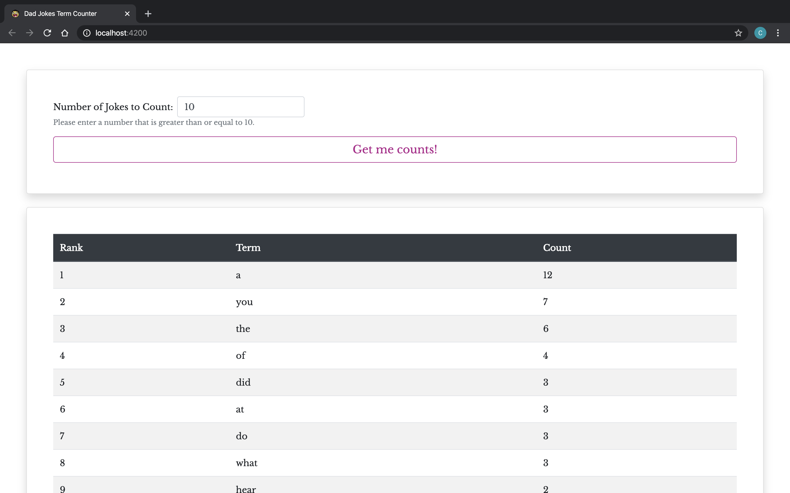
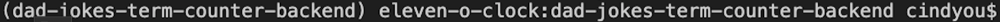
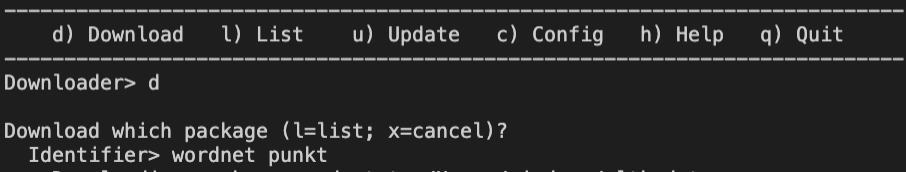
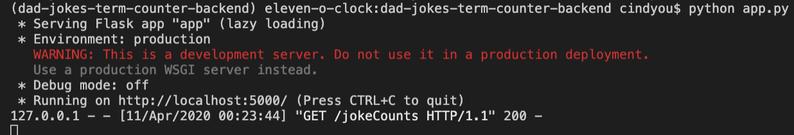
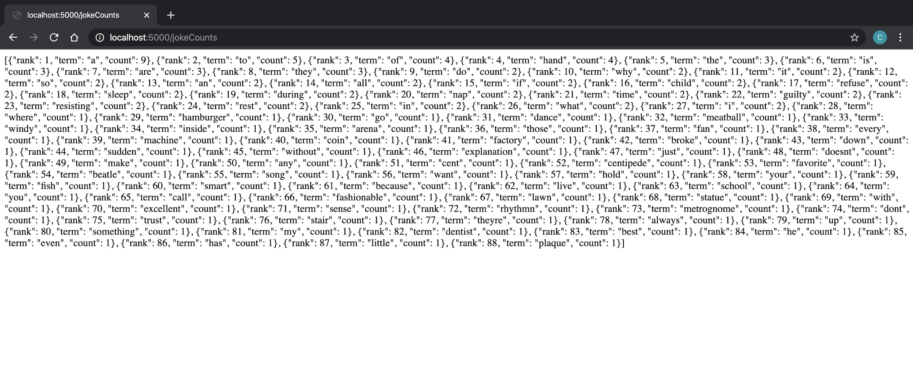
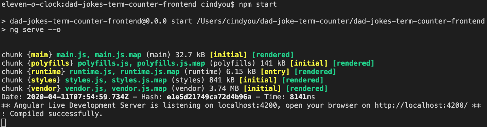
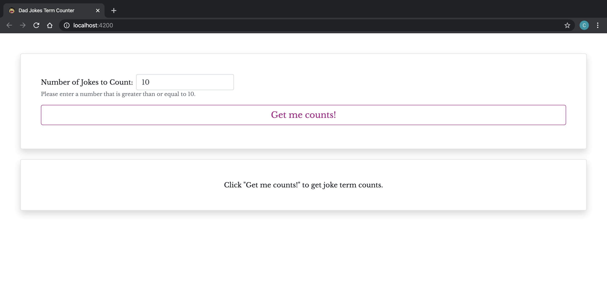

# :bowtie: Dad Jokes Term Counter

***
## Table of Contents
- [Getting Started](#getting-started)
- [The Backend](#the-backed)
    - [Setting Up the Python Environment](#setting-up-the-python-environment)
    - [Running the Python Code](#running-the-python-code)
- [The Frontend](#the-frontend)
    - [Setting Up the Angular Environment](#setting-up-the-Angular-environment)
    - [Running the Angular Code](#running-the-Angular-code)

## Getting Started
Setup instructions for this project are split into the backend and frontend components.
* For the backend, if you already have your environment setup for running Python, go straight to [Running the Python Code](#running-the-python-code). 
* For the frontend, if you already have your environment setup for running Angular, go straight to [Running the Angular Code](#running-the-angular-code).

Once you've got the backend and frontend components successfully running, the application look as follows after clicking the "Get me counts!" button:

## :snake: The Backend
### Setting Up the Python Environment
**Skip this part if your environment is already setup to run Python.**
For this project, I've used [`pyenv`](https://github.com/pyenv/pyenv) with [`pyenv-virtualenv`](https://github.com/pyenv/pyenv-virtualenv) on macOS. For Windows, you can use [`pyenv-win`](https://github.com/pyenv-win/pyenv-win) and [`virtualenvwrapper`](https://virtualenvwrapper.readthedocs.io/en/latest/), which basically does the same things.

* Install homebrew if you don't already have it:
    * Mac: run the following command in terminal `/usr/bin/ruby -e "$(curl -fsSL https://raw.githubusercontent.com/Homebrew/install/master/install)"`
    * Linux: https://docs.brew.sh/Homebrew-on-Linux

* Install `pyenv` and `pyenv-virtualenv` by running `brew install pyenv && brew install pyenv-virtualenv`

* Add `pyenv init` and `pyenv virtualenv-init` to your bash shell by running:
> ` echo -e 'if command -v pyenv 1>/dev/null 2>&1; then\n  eval "$(pyenv init -)"\nfi \n if which pyenv-virtualenv-init > /dev/null; then eval "$(pyenv virtualenv-init -)"; fi' >> ~/.bash_profile`

* Install Python 3.7.6 via `pyenv` by running `pyenv install 3.7.6`

* In your bash shell, create your virtual environment by running`pyenv virtualenv 3.7.6 dad-joke-term-counter-backend`. Then go to the root directory of our repo and run: `pyenv local dad-joke-term-counter-backend`. From now on, the virtual environment will always automatically activate when you are in the **dad-joke-term-counter-backed** folder of the repo. You should see `(dad-joke-term-counter)` appearing on the left of your prompt line as below:

### Running the Python Code
* In your bash shell go into the **dad-joke-term-counter-backend** folder (from the root repo run: `cd dad-joke-term-counter-backend`)

* Install dependencies by running `pip install -r requirements.txt`

* Install [NLTK dependencies](https://www.nltk.org/install.html), the packages required for this project are: `punkt` and `wordnet`. The `requirements.txt` file includes `nltk` as a dependency. You may choose to follow the instructions on website for installing the required packages or do the following:
    * Run the command: `python -m nltk.downloader`
    * Follow the prompt (first enter `d`, then enter the identifiers as follows `punkt wordnet`)

* Now run `python app.py` and visit http://localhost:5000/jokeCounts to see json data

## :shield: The Frontend
### Setting Up the Angular Environment
**Skip this part if your environment is already setup to run Angular.**
* Install Node and npm if you don't already have it (https://nodejs.org/en/)

* Install Angular CLI by running `npm install -g @angular/cli`

#### Running the Angular Code
* In your shell go into the **dad-joke-term-counter-frontend** folder (from the root repo run: `cd dad-joke-term-counter-frontend`)

* Install dependencies by running `npm install`

* Build the app by running `npm run build` or `ng build`

* Run the app by running `npm start` or `ng serve --o`. This will automatically open a browser window to the application at http://localhost:4200/. Make sure you already have the backend running first to get data!

